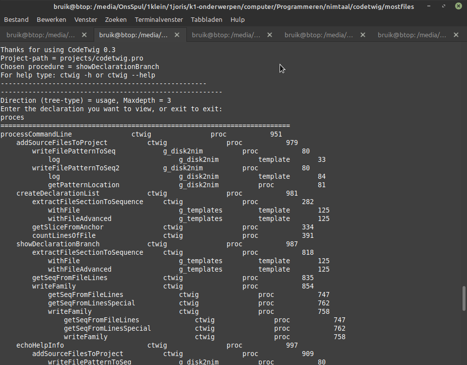

## CodeTwig - A code viewer and analyser

[See below for more screenshots](#more-screenshots)

[Go to downloadable releases](https://github.com/some-avail/codetwig/releases "Downloads for CodeTwig")

[Go to the user-manual](mostfiles/manual_codetwig.txt)

#### Forthcoming version: 1.56

### Description CodeTwig

CodeTwig (CT) is terminal-program to view the outline of the source-code and to show procedures as usage-trees or used-by-trees. Some features are still to be added. See future-plans below. Currently only meant for Nim.

#### Features
- CT scans the source-code-files on basis of the project you have defined.
- It creates a declaration-list in which all declarations like procs and templates are listed.
- The declaration-list is used to generate 4 text-files that give specific views of the project.
- CT can also show (for a certain declaration / proc) the usage-trees and used-by trees on basis of the dec-list, and gives with it the arguments and the comment-section.
- flexible semicolumn-separated search: declaration;module;project
- CT can combine dec-list of multiple projects and thus show trees for multiple projects (multiproject-feature).
- all functions are called by entering terminal-commands, allthough the generated view-files can be watched by themselves of course.

### Installation by building
Since the program (at this stage) is for Nim only, users = programmers are assumed to be able to build the executable themselves.
Developers can download a release, or clone the code 
(CodeTwig has no external components) and do the following:

Run the command:
nim c -d:release ctwig.nim
which will compile the code to an executable for you local OS.

### Using CodeTwig
[Go to the user-manual](mostfiles/manual_codetwig.txt)

### What's new in x.y?
[Open the whats-new-file](mostfiles/whatsnew_codetwig.txt)

Or look at the commits.
[Commits-list](https://github.com/some-avail/codetwig/commits/main)

#### Completed from future plans
- ct 1.56
  - recursively scan multiple dir-levels for source-files.
  - added a project-field so that multiple projects can be added to one declaration-list to enable multi-project search.
  - added flexible semicolumn-separated search: declaration;module;project

### Remaining future plans:
- add a source-view option; after searching show the source-code of the proc /declaration.
- better automatic source-file-selection
  - filter out backups, copies and older versions of source-files.
- add an options-file.

<a name="more-screenshots">More screenshots:</a>
Forthcoming.

